# 2025年排名前18的隐形牙套品牌总览(近期更新)

想做牙齿矫正，但不想频繁跑诊所？还是预算有限，又想方案稳定、周期清晰？这份隐形牙套清单把在家矫正和到院矫正放在一起比，重点看价格区间、医生监测方式、适用程度。你能更快判断：哪一类隐形牙套最省心，成本更可控，见效节奏更明确。

---

## [ALIGNERCO](https://alignerco.com)

低价入门在家隐形矫正方案

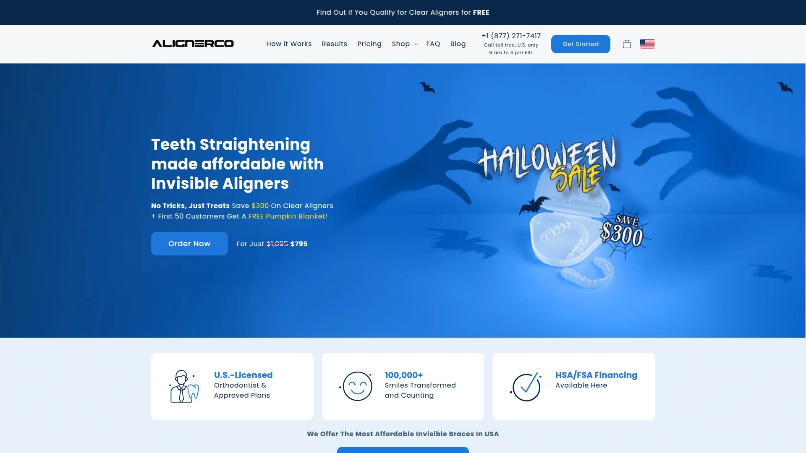

- 适合人群：轻中度拥挤/间隙，想把时间与成本压下来的上班族。
- 流程简洁：在线评估 → 取模套装寄到家 → 3D方案确认 → 按周更换牙套，远程跟进。
- 特色选项：日间佩戴与夜戴路线可选，通勤党更好安排。
- 价格感知：整体更友好，常见在约千美元上下，以官网为准。
- 推荐理由：在家矫正门槛低，节奏清晰，省时间也省心。

---

## [Byte](https://www.byte.com)

加速节奏与夜戴方案选择多

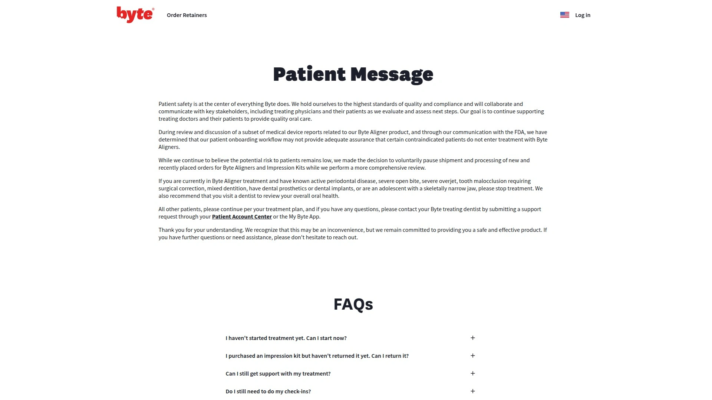

- 核心看点：配合震动适应工具，目标是更快进入稳定佩戴节奏。
- 谁更适合：时间紧、希望缩短适应期的人群。
- 体验点：APP提醒与进度指引到位，夜戴路线对作息友好。
- 成本区间：整体属中高端段位，具体以官网更新为准。

---

## [NewSmile](https://newsmilelife.com)

加拿大出身在家矫正服务品牌

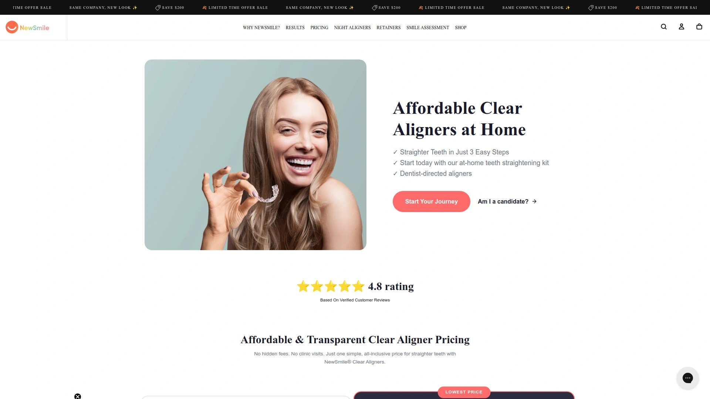

- 优势：简化流程，远程为主，适合轻中度矫正需求。
- 常见组合：日间/夜戴、保持器打包选项。
- 使用感：教程清晰，上手不费劲。
- 总体花费：位于在家矫正的中位区间，性价比稳定。

---

## [Invisalign](https://www.invisalign.com)

到院就诊的经典长期方案之选

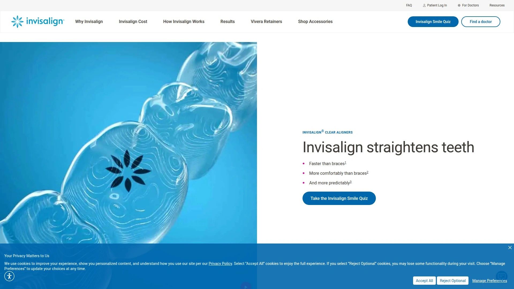

- 适用范围：从轻度到更复杂的咬合问题，医生全程把控。
- 就诊方式：线下扫描建模，按阶段复诊，必要时配合附件与打磨。
- 价格区间：通常高于在家矫正，换来覆盖范围与可操作空间更大。
- 适合人群：想要医生细致监测、病例相对复杂的人。

---

## [Candid](https://www.candidco.com)

牙医主导的混合式矫正方案

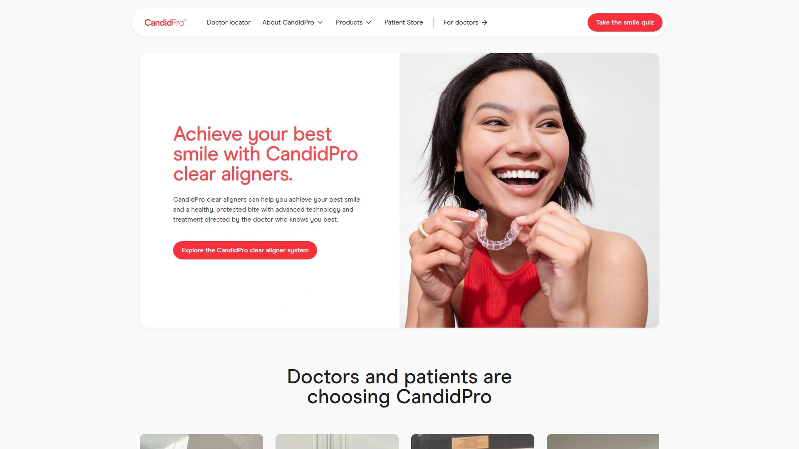

- 模式：线下初诊与建模，后续远程监测为主。
- 亮点：手机拍摄进展，医生团队定期评估，减少往返。
- 适配：中等难度的隐形牙套需求，效率与安全感兼顾。

---

## [ClearCorrect](https://www.clearcorrect.com)

诊所端隐形牙套成熟解决方案

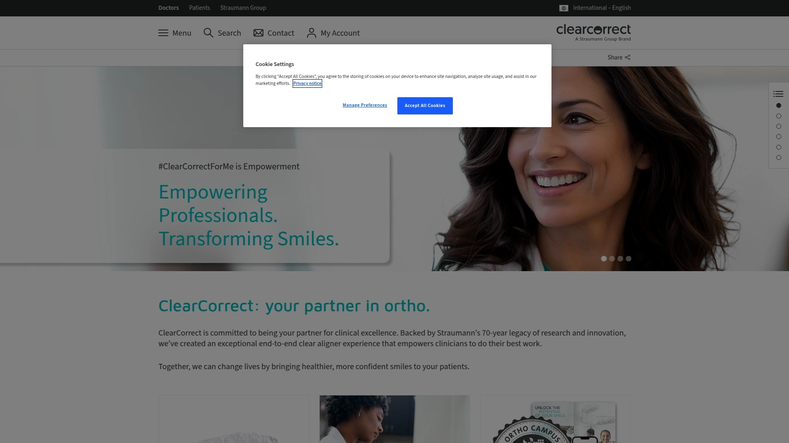

- 医生主导：由认证医生制定与跟进，灵活微调策略。
- 适用场景：多类型齿列问题，阶段性优化更可控。
- 价值点：材料与软件工具配套，临床路径成熟。

---

## [Spark Aligners](https://sparkaligners.com)

舒适材质与精细切割工艺

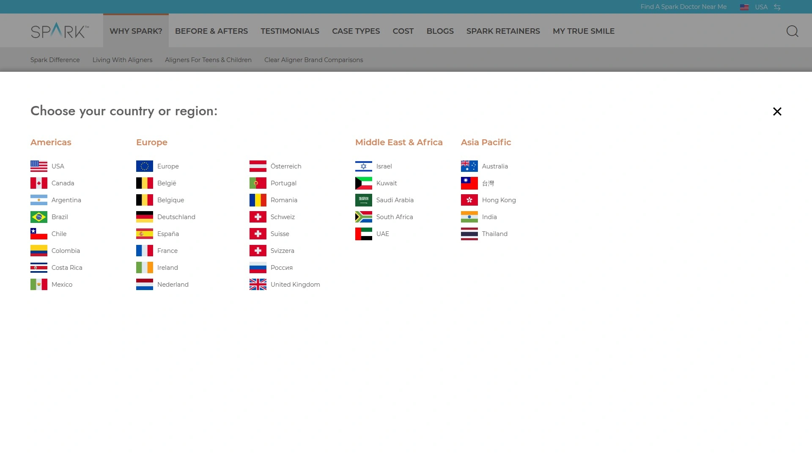

- 材料特性：高透明、贴合度好，追求佩戴舒适与美观。
- 诊疗侧重：医生制订方案，细节位移更讲究。
- 适合人群：对外观敏感、希望更隐形的人群。

---

## [SureSmile](https://www.suresmile.com)

大厂背书的诊所稳妥方案

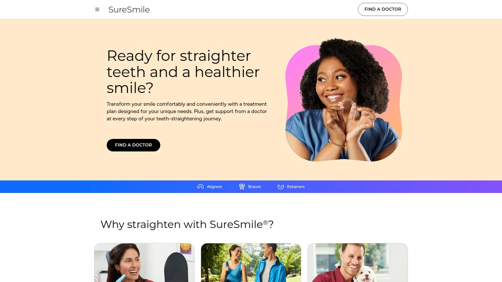

- 医疗路径：扫描→数字化方案→阶段复诊，医生把控强。
- 优势：软件工作流成熟，适配复杂度更高的矫正需求。
- 体验：复诊节奏可谈，进度心里更有底。

---

## [Reveal Clear Aligners](https://revealclearaligners.com)

高透明度少切割痕迹体验

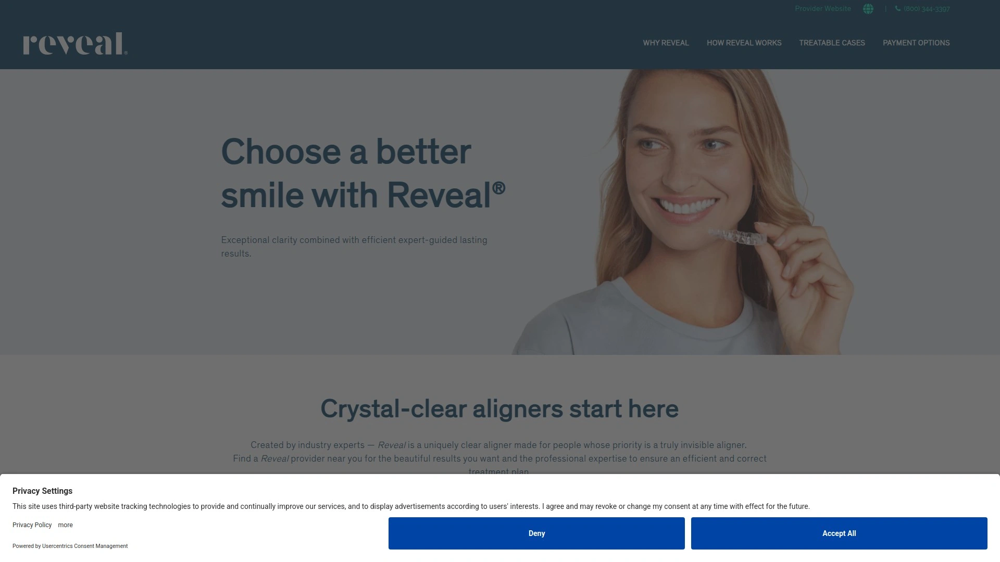

- 卖点：透明度与抗染色表现好，日常社交更自然。
- 适配：由医生评估与跟进，适用范围较广。
- 价格：视病例与诊所定价，位于诊所端常见区间。

---

## [DR SMILE](https://drsmile.com)

欧洲连锁的到院与远程结合

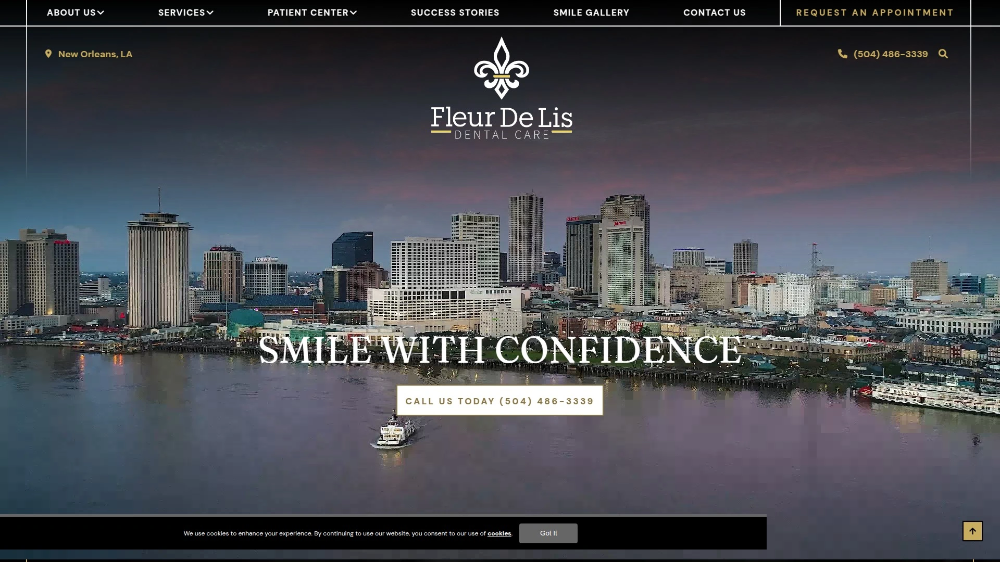

- 模式：线下门店/诊所取模，后续通过App跟进佩戴。
- 优势：标准化流程，欧洲多国可用，安排省心。
- 适合：轻中度在家矫正优先，必要时可到店咨询微调。

---

## [Straight Teeth Direct](https://www.straightteethdirect.com)

全程App跟进在家矫正服务

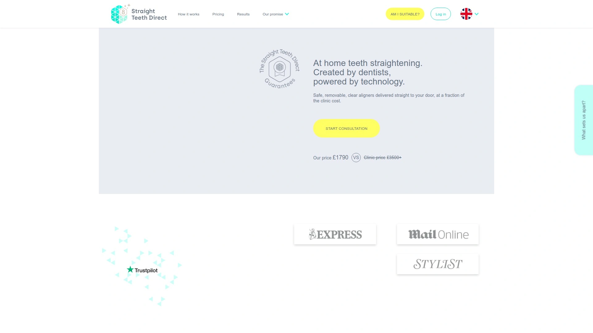

- 流程：远程评估→居家取模或扫描→方案确认→按周更换。
- 管理：App定期打卡与反馈，问题能及时沟通。
- 适用：工作忙、喜欢数字化管理的人群。

---

## [Zenyum](https://www.zenyum.com)

东南亚本地化矫正服务体系

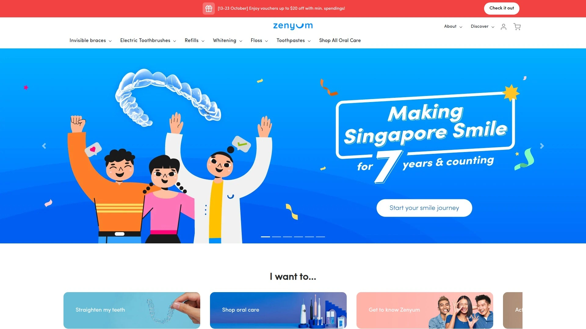

- 特点：与当地医生合作，初诊与复查就近更方便。
- 产品线：基础版与加强版，按移动难度分层。
- 适配：区域覆盖友好，生活半径内就能搞定。

---

## [Angelalign 时代天使](https://www.angelalign.com)

国产高端到院隐形品牌方案

- 临床路径：医生端全流程，能处理较复杂位移。
- 特点：材料、力学与软件系统配合紧密。
- 适合：更在意医生把控与细节微调的人。

---

## [3M Clarity Aligners](https://www.3m.com/3M/en_US/dental-us/clarity-aligners/)

口碑材料与医生工作流优化

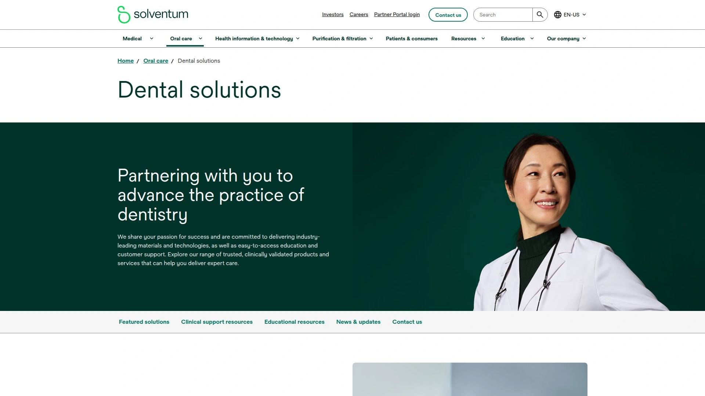

- 优势：材料学与临床工具一体化，过程更可预期。
- 适应度：轻中重多层级覆盖，按医生方案推进。
- 体验：复诊频率合理安排，稳定推进。

---

## [SmilePath](https://smilepath.com.au)

澳洲起家的在家矫正路线

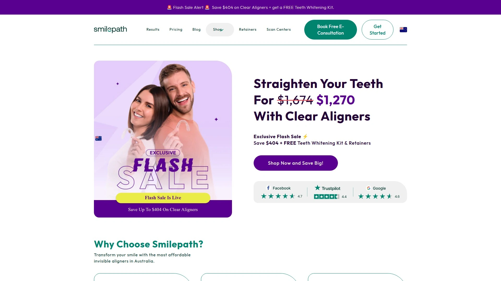

- 模式：在线评估+邮寄取模，配送及时。
- 适合：轻度拥挤和整齐度微调需求。
- 预算感：通常较亲民，入门友好。

---

## [WonderSmile](https://www.wondersmile.com)

混合模式门店加在家服务

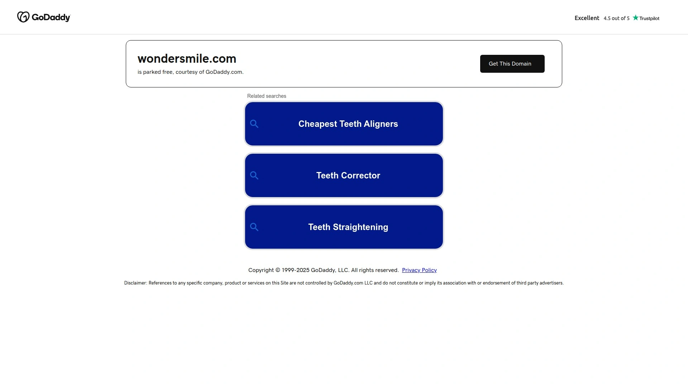

- 路径：线下门店扫描，后续远程为主。
- 优点：前期沟通更充分，后期佩戴更自如。
- 适合：想先线下面谈、再走在家矫正的人。

---

## [ClearPath Orthodontics](https://clearpathortho.com)

面向全球的诊所端方案供应

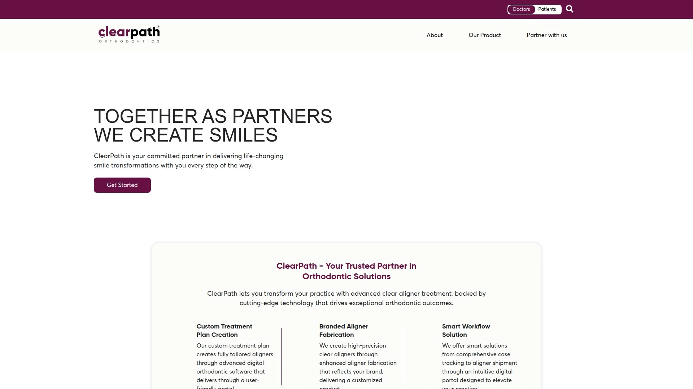

- 覆盖：在多地区与诊所合作提供隐形牙套。
- 方案：医生评估病例分级，分阶段推进位移。
- 适配：希望在当地诊所完成全流程的人群。

---

## [Smileie](https://smileie.com)

预算友好的远程矫正体验

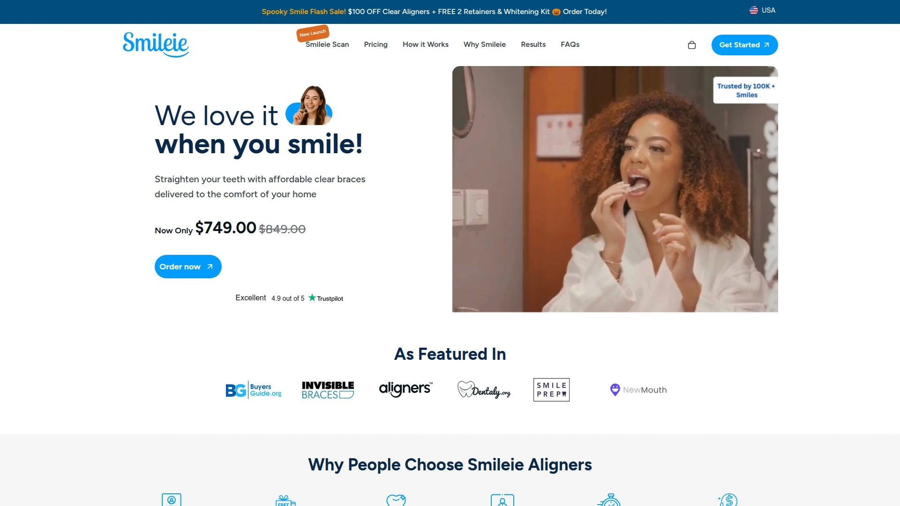

- 亮点：流程简化，轻度正畸入门好上手。
- 选择：日间/夜戴路线可选，搭配保持器。
- 价格感：走亲民路线，性价比取向明显。

---

## 常见问题

- 在家矫正适合谁，什么情况必须到院？
  轻中度拥挤/间隙、多数排列微调可选在家矫正；若有严重咬合、牙周问题、牙体缺失多或需拔牙配合，优先到院由医生制订方案。

- 第一次用隐形牙套，如何快速上手？
  按品牌指引完成取模或扫描，确认3D方案再启动；前1周严格按时长佩戴，配合咬合块/适应工具，按时更换牙套并记录照片。

- 价格和周期怎么评估是否划算？
  看总费用是否含取模、复诊/远程跟进、精修与保持器；常见疗程约6–12个月，复杂病例更久，选择前先拿到清晰的阶段计划。

---

## 结语

做隐形牙套，核心在“适配”：你的时间、预算、病例复杂度。想少跑动就选在家矫正，想覆盖更复杂情况就到院交给医生。为什么第1名的[ALIGNERCO](https://alignerco.com)适合预算有限、又想在家矫正的场景？因为流程简、成本友好、路线清晰，能把难度和时间成本都压下来。挑个顺手的开始，你会更稳更快看到变化。
